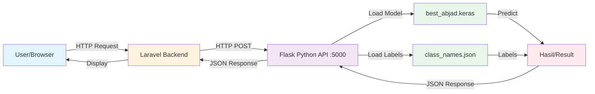

# 🚀 BISINDO CNN - Setup Guide

## Arsitektur Sistem



**Alur Kerja:**
1. **User** berinteraksi dengan aplikasi Laravel (web UI)
2. **Laravel** mengirim gambar ke Python API (Flask)
3. **Flask API** memproses gambar dan melakukan prediksi menggunakan model Keras
4. **Model** (`best_abjad.keras`) mengembalikan hasil prediksi
5. **API** mengirim hasil ke Laravel
6. **Laravel** menampilkan hasil ke user

---

## 📋 Requirements

### System Requirements
- **OS**: Windows/Linux/MacOS
- **Python**: 3.10 (PENTING: Harus versi 3.10)
- **PHP**: 8.x (untuk Laravel)
- **Laragon/XAMPP**: Untuk menjalankan Laravel

### Python Dependencies
```
flask==3.0.0
flask-cors==4.0.0
tensorflow==2.15.0
numpy==1.24.3
opencv-python==4.8.1.78
Pillow==10.1.0
```

---

## 🔧 Instalasi

### 1. Setup Python Environment

#### Opsi A: Menggunakan Virtual Environment (Recommended)

```bash
# Buat virtual environment
python -m venv .venv

# Aktifkan virtual environment
# Windows:
.venv\Scripts\activate

# Linux/Mac:
source .venv/bin/activate
```

#### Opsi B: Install Global
Jika tidak menggunakan virtual environment, lanjut ke step berikutnya.

---

### 2. Install Python Dependencies

```bash
# Masuk ke folder api
cd c:\laragon\www\BisindoCNN\api

# Install semua dependencies
pip install -r requirements.txt
```

**Verifikasi instalasi:**
```bash
python -c "import tensorflow as tf; print(f'TensorFlow: {tf.__version__}')"
python -c "import cv2; print(f'OpenCV: {cv2.__version__}')"
python -c "import numpy as np; print(f'NumPy: {np.__version__}')"
```

Expected output:
```
TensorFlow: 2.15.0
OpenCV: 4.8.1
NumPy: 1.24.3
```

---

### 3. Verifikasi File Model

Pastikan file berikut ada di lokasi yang benar:

```
c:\laragon\www\BisindoCNN\storage\app\public\models\
├── best_abjad.keras      (Model file ~57 MB)
└── class_names.json      (Label file)
```

**Cek keberadaan file:**
```bash
# Windows PowerShell:
dir ..\storage\app\public\models\

# Atau Python:
python -c "import os; print('Model exists:', os.path.exists('../storage/app/public/models/best_abjad.keras'))"
```

---

## ▶️ Menjalankan Aplikasi

### Step 1: Jalankan Laravel (Backend)

```bash
# Terminal 1 - dari root project
cd c:\laragon\www\BisindoCNN

# Start Laravel development server
php artisan serve
```

Laravel akan berjalan di: `http://127.0.0.1:8000`

---

### Step 2: Jalankan Python API

```bash
# Terminal 2 - dari folder api
cd c:\laragon\www\BisindoCNN\api

# Pastikan virtual environment aktif (jika menggunakan)
# Windows: .venv\Scripts\activate

# Jalankan Flask API
python app.py
```

Output yang diharapkan:
```
============================================================
🚀 BISINDO Detection API - Initializing
============================================================
TensorFlow: 2.15.0
Model: c:\laragon\www\BisindoCNN\storage\app\public\models\best_abjad.keras
Labels: c:\laragon\www\BisindoCNN\storage\app\public\models\class_names.json
Files exist: Model=True, Labels=True
============================================================
✓ Labels loaded: 26 classes
  Classes: ['A', 'B', 'C', ...]

📦 Loading EfficientNetV2 model...
  Strategy 1: safe_mode=False...
  ✓ Success with safe_mode=False!
  Image size: 224x224
============================================================
✅ Ready to serve!
============================================================

🎯🎯🎯🎯🎯🎯🎯🎯🎯🎯🎯🎯🎯🎯🎯🎯🎯🎯🎯🎯🎯🎯🎯🎯🎯🎯🎯🎯🎯🎯
   API RUNNING at http://127.0.0.1:5000
🎯🎯🎯🎯🎯🎯🎯🎯🎯🎯🎯🎯🎯🎯🎯🎯🎯🎯🎯🎯🎯🎯🎯🎯🎯🎯🎯🎯🎯🎯

💡 Test: http://127.0.0.1:5000/health
🛑 Press CTRL+C to stop
```

API akan berjalan di: `http://127.0.0.1:5000`

---

## 🧪 Testing API

### 1. Test Health Check

**Browser:**
Buka: http://127.0.0.1:5000/health

**cURL:**
```bash
curl http://127.0.0.1:5000/health
```

**Expected Response:**
```json
{
  "status": "ok",
  "model_loaded": true,
  "num_classes": 26,
  "image_size": 224,
  "tensorflow_version": "2.15.0"
}
```

---

### 2. Test Root Endpoint

```bash
curl http://127.0.0.1:5000/
```

**Expected Response:**
```json
{
  "service": "BISINDO Detection API",
  "model": "EfficientNetV2B0",
  "classes": 26,
  "endpoints": {
    "POST /predict": "Predict sign language",
    "GET /health": "Health check"
  }
}
```

---

### 3. Test Prediction

**JavaScript (dari Laravel/Browser):**
```javascript
// Capture image dari webcam (base64)
const canvas = document.createElement('canvas');
canvas.width = video.videoWidth;
canvas.height = video.videoHeight;
canvas.getContext('2d').drawImage(video, 0, 0);
const imageBase64 = canvas.toDataURL('image/jpeg').split(',')[1];

// Kirim ke Flask API
const formData = new FormData();
formData.append('image_base64', imageBase64);

fetch('http://127.0.0.1:5000/predict', {
    method: 'POST',
    body: formData
})
.then(response => response.json())
.then(data => {
    console.log('Label:', data.label);
    console.log('Confidence:', data.confidence);
})
.catch(error => console.error('Error:', error));
```

**cURL (dengan file gambar):**
```bash
# Convert image ke base64
$base64 = [Convert]::ToBase64String([IO.File]::ReadAllBytes("path/to/image.jpg"))

# Send request
curl -X POST http://127.0.0.1:5000/predict -F "image_base64=$base64"
```

**Expected Response:**
```json
{
  "label": "A",
  "confidence": 95.43
}
```

---

## 📡 API Endpoints Reference

| Method | Endpoint | Description | Request | Response |
|--------|----------|-------------|---------|----------|
| GET | `/` | Root info | - | Service info |
| GET | `/health` | Health check | - | Model status |
| POST | `/predict` | Predict image | `image_base64` (form-data) | Label & confidence |

---

## 🔍 Troubleshooting

### Error: "Model not found"
**Problem:** File model tidak ditemukan
**Solution:**
```bash
# Cek path model
python -c "import os; print(os.path.abspath('../storage/app/public/models/best_abjad.keras'))"

# Pastikan file ada di lokasi tersebut
```

---

### Error: "ModuleNotFoundError: No module named 'xxx'"
**Problem:** Dependencies belum terinstall
**Solution:**
```bash
pip install -r requirements.txt
```

---

### Error: Incompatible model format
**Problem:** Model tidak kompatibel dengan TensorFlow 2.15.0
**Solution:** Re-save model menggunakan script:
```bash
# Jika punya akses ke training environment
python resave_model.py

# Atau jika model dari Kaggle
# Gunakan resave_kaggle.py di Kaggle notebook
```

---

### Error: CORS issues
**Problem:** Laravel tidak bisa akses API karena CORS
**Solution:** Sudah ditangani oleh `flask-cors`. Pastikan package terinstall:
```bash
pip install flask-cors==4.0.0
```

---

### Low confidence predictions
**Problem:** Prediksi confidence rendah atau tidak akurat
**Solution:**
1. Pastikan preprocessing sesuai dengan training
2. Cek kualitas gambar input (harus jelas, lighting bagus)
3. Pastikan gesture sesuai dengan training data

---

### Python version mismatch
**Problem:** TensorFlow tidak kompatibel dengan Python version
**Solution:**
```bash
# Cek Python version
python --version

# Harus Python 3.10.x
# Jika bukan, install Python 3.10 dan buat virtual environment baru
```

---

## 📂 Struktur Project

```
BisindoCNN/
├── api/                              # Python Flask API
│   ├── app.py                        # Main API file
│   ├── requirements.txt              # Python dependencies
│   ├── resave_kaggle.py              # Script untuk re-save model dari Kaggle
│   ├── resave_model.py               # Script untuk re-save model lokal
│   └── README.md                     # API documentation
│
├── app/                              # Laravel app
│   └── Http/
│       └── Controllers/              # Laravel controllers
│
├── storage/
│   └── app/
│       └── public/
│           └── models/               # Model files
│               ├── best_abjad.keras  # Trained model (~57 MB)
│               └── class_names.json  # Class labels
│
├── resources/
│   └── views/                        # Laravel Blade templates
│
└── routes/
    └── web.php                       # Laravel routes
```

---

## 🎯 Integration dengan Laravel

### Contoh Controller Laravel:

```php
// app/Http/Controllers/PredictionController.php
<?php

namespace App\Http\Controllers;

use Illuminate\Http\Request;
use Illuminate\Support\Facades\Http;

class PredictionController extends Controller
{
    public function predict(Request $request)
    {
        // Validasi input
        $request->validate([
            'image_base64' => 'required|string'
        ]);

        try {
            // Kirim ke Python API
            $response = Http::asForm()->post('http://127.0.0.1:5000/predict', [
                'image_base64' => $request->image_base64
            ]);

            if ($response->successful()) {
                $data = $response->json();
                
                return response()->json([
                    'success' => true,
                    'label' => $data['label'],
                    'confidence' => $data['confidence']
                ]);
            } else {
                return response()->json([
                    'success' => false,
                    'error' => 'API request failed'
                ], 500);
            }
        } catch (\Exception $e) {
            return response()->json([
                'success' => false,
                'error' => $e->getMessage()
            ], 500);
        }
    }
}
```

### Routes:
```php
// routes/web.php
Route::post('/api/predict', [PredictionController::class, 'predict'])->name('predict');
```

---

## 📝 Notes

1. **Performance**: 
   - First prediction akan lebih lambat (model loading)
   - Subsequent predictions akan lebih cepat
   - Gunakan `debug=False` di production

2. **Security**:
   - API sekarang running di `127.0.0.1` (localhost only)
   - Untuk production, implement authentication
   - Validate image size dan format

3. **Optimization**:
   - Gunakan GPU jika tersedia untuk TensorFlow
   - Batch predictions jika memungkinkan
   - Cache model di memory (sudah diimplementasi)

---

## 🆘 Support

Jika mengalami masalah:
1. Cek log di terminal Flask API
2. Cek log Laravel (`storage/logs/laravel.log`)
3. Verifikasi semua dependencies terinstall dengan benar
4. Pastikan Python version 3.10

---

**Created for:** BISINDO CNN Project  
**Last Updated:** December 2025
