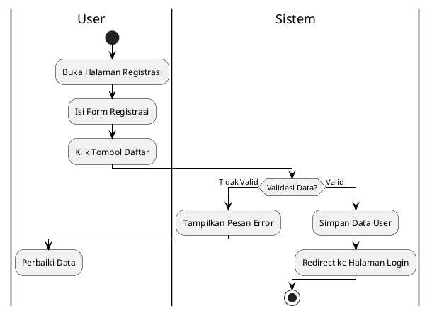
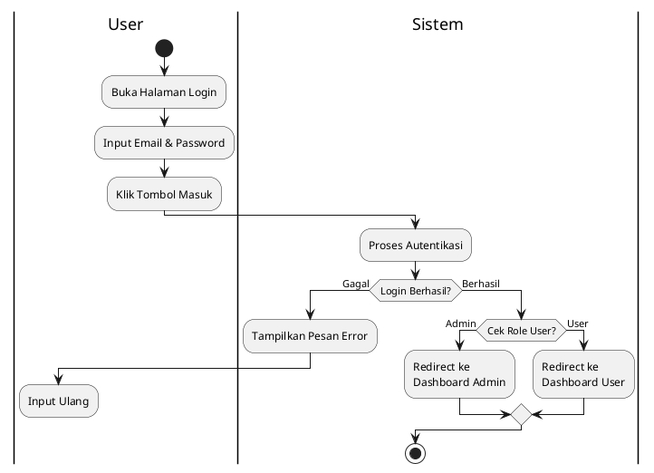
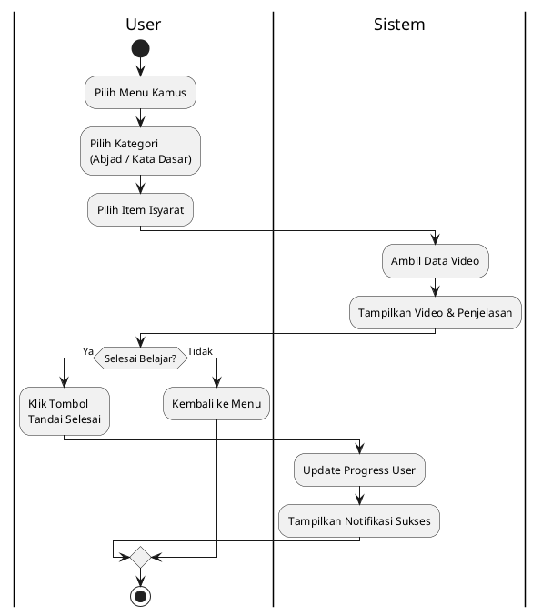
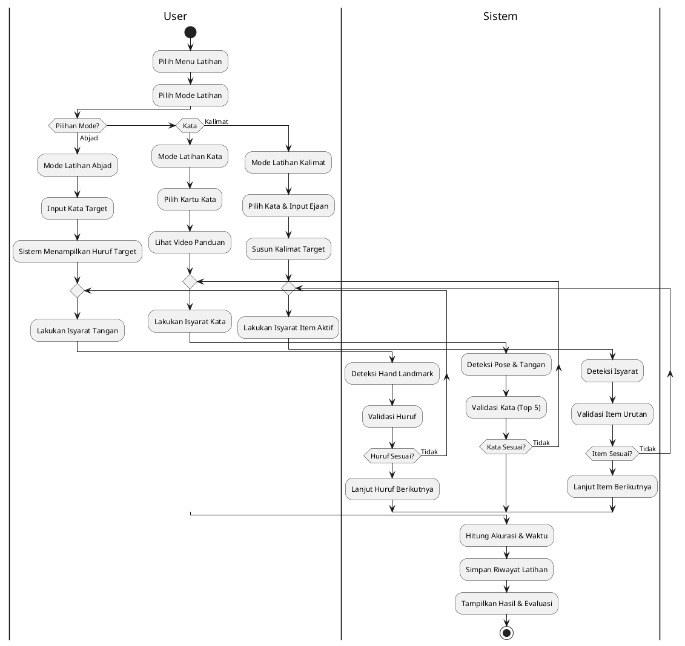
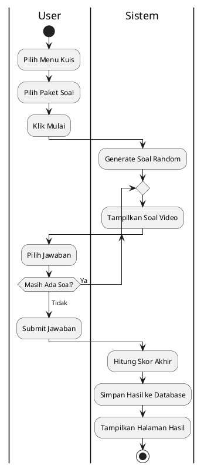
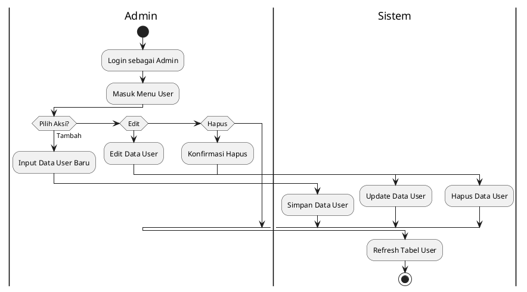
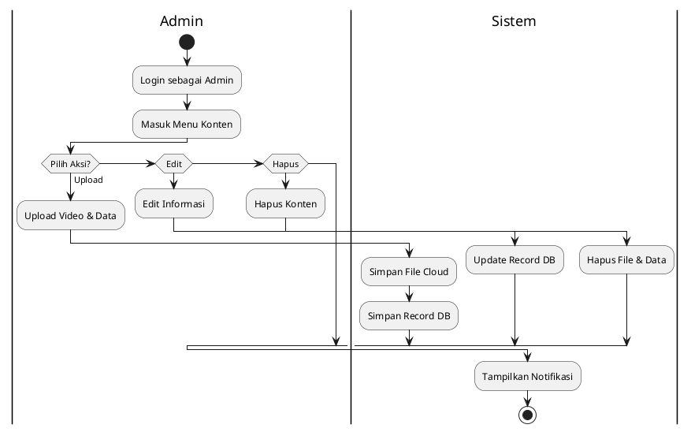
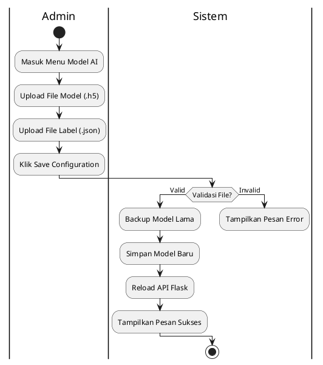

# Activity Diagram Sistem BisindoCNN

Karena Anda sudah menginstal ekstensi **PlantUML**, berikut adalah kode final yang paling optimal. Kode ini menggunakan sintaks swimlane standar (`|Nama Kolom|`) yang akan menghasilkan kolom vertikal terpisah dengan sangat rapi, persis seperti standar skripsi.

> **Cara Render:** Buka file ini di VS Code, lalu tekan `Alt + D` untuk melihat diagramnya.

---

## Legenda Simbol (Activity Diagram)

| Simbol | Nama | Fungsi | Representasi di PlantUML |
| :---: | :--- | :--- | :--- |
| 🔴/🟢 | **Initial/Final Node** | Titik mulai (Start) dan akhir (End). | `start`, `stop`, `detach` |
| ▭ | **Action/Activity** | Suatu langkah atau tindakan yang dilakukan. | `:Nama Aktivitas;` |
| 🔷 | **Decision** | Percabangan keputusan (Ya/Tidak). | `if`, `elseif`, `else` |
| ⎯ | **Control Flow** | Arah aliran aktivitas. | `->` (Panah) |
| ▌ | **Fork/Join** | Memecah atau menyatukan aliran paralel. | `fork`, `fork again`, `split` |
| 🏊 | **Swimlane** | Mengelompokkan aktivitas berdasarkan aktor/sistem. | `|Nama Aktor|` |

---

## 1. Activity Diagram: Registrasi User

## 2. Activity Diagram: Login User

## 3. Activity Diagram: Fitur Kamus

## 4. Activity Diagram: Latihan Deteksi (Real-time)

## 5. Activity Diagram: Pengerjaan Kuis

## 6. Activity Diagram: Manajemen User (Admin)

## 7. Activity Diagram: Manajemen Konten (Admin)

## 8. Activity Diagram: Upload Model AI (Admin)

