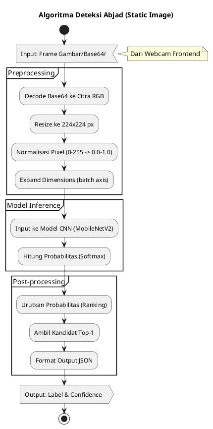
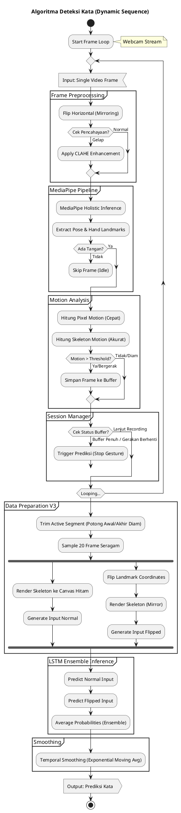

# Flowchart Algoritma AI (Format PlantUML)

Dokumen ini berisi diagram alur algoritma dalam format **PlantUML**.
Tekan `Alt + D` di VS Code untuk me-render diagram (jika ekstensi PlantUML terinstall).

---

## 1. Algoritma Deteksi Abjad (Sistem Statis)

---

## 2. Algoritma Deteksi Kata (Sistem Dinamis)

