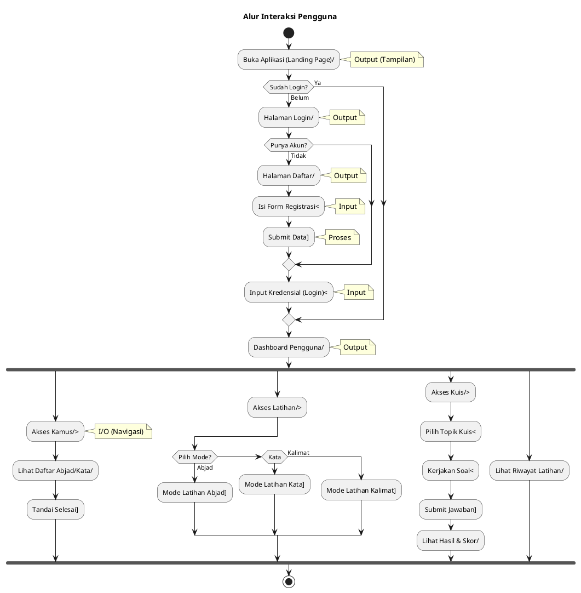
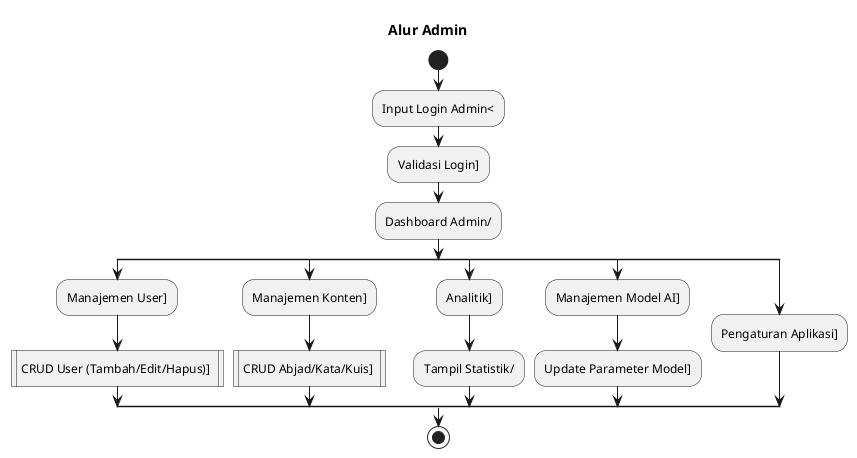
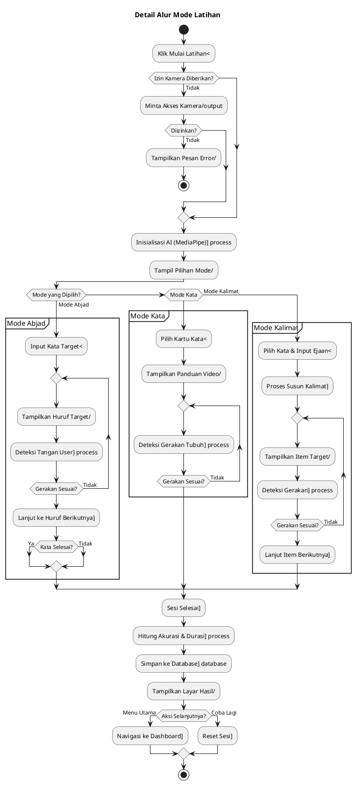

# Flowchart Aplikasi BisindoCNNfi (Bahasa Indonesia)

Dokumen ini berisi kode **PlantUML** untuk alur kerja aplikasi. Sesuai permintaan Anda, saya telah menambahkan **Panduan Simbol** di bawah setiap kode program untuk menjelaskan simbol standar industri apa yang harus digunakan jika Anda menggambarnya ulang secara manual (misalnya di Visio atau draw.io).

---

## Legenda Simbol (Standar Industri Flowchart)

| Simbol | Nama | Fungsi | Representasi di PlantUML |
| :---: | :--- | :--- | :--- |
| 🔴/🟢 | **Terminator** | Awal (Start) atau Akhir (End) dari alur. | `start`, `stop` |
| 🔷 | **Decision** | Keputusan Ya/Tidak atau percabangan logika. | `if`, `elseif` |
| ▱ | **Input/Output (I/O)** | Masukan data (ketik, klik) atau Keluaran (tampilan layar). | `:Masukkan...;`, `:Tampilkan...;` |
| ▭ | **Process** | Proses internal sistem, perhitungan, atau tindakan. | `:Validasi...;`, `:Hitung...;` |
| 🛢️ | **Database** | Penyimpanan atau pengambilan data. | `:Simpan ke DB;` |

---

## 1. Alur Interaksi Pengguna (User Flow)

### Kode PlantUML

### Panduan Simbol Manual
Jika Anda menggambar ulang, gunakan bentuk berikut:

1.  **Terminator (Oval)**: Start, Stop.
2.  **I/O (Jajargenjang)**:
    *   Buka Aplikasi
    *   Halaman Login / Daftar / Dashboard
    *   Isi Form / Input Kredensial
    *   Lihat Daftar/Hasil/Riwayat
    *   Pilih Mode / Topik
3.  **Process (Persegi Panjang)**:
    *   Submit Data
    *   Tandai Selesai
    *   Reset Password (jika ada)
4.  **Decision (Belah Ketupat)**:
    *   Sudah Login?
    *   Punya Akun?
    *   Pilih Mode?

---

## 2. Alur Admin (Admin Flow)

### Kode PlantUML

### Panduan Simbol Manual
1.  **I/O (Jajargenjang)**: Input Login Admin, Dashboard Admin, Tampil Statistik.
2.  **Process (Persegi Panjang)**: Validasi Login, CRUD User/Konten, Update Parameter.

---

## 3. Detail Alur Mode Latihan

### Kode PlantUML

### Panduan Simbol Manual
1.  **Terminator (Oval)**: Start, Stop.
2.  **Decision (Belah Ketupat)**:
    *   Izin Kamera Diberikan?
    *   Diizinkan?
    *   Mode yang Dipilih?
    *   Gerakan Sesuai?
    *   Kata Selesai?
    *   Aksi Selanjutnya?
3.  **Process (Persegi Panjang)**:
    *   Inisialisasi AI
    *   Deteksi Tangan/Gerakan
    *   Lanjut ke Huruf/Item Berikutnya
    *   Hitung Akurasi & Durasi
    *   Reset Sesi
4.  **I/O (Jajargenjang)**:
    *   Klik Mulai / Input Kata / Pilih Kartu
    *   Minta Akses Kamera
    *   Tampilkan Pesan Error / Huruf Target / Panduan / Hasil
5.  **Database (Tabung)**:
    *   Simpan ke Database
