# Diagram UML Aplikasi BisindoCNNfi (Mermaid Format)

Dokumen ini berisi kumpulan diagram UML untuk aplikasi BisindoCNNfi yang telah dirapikan untuk keterbacaan maksimal. Format yang digunakan adalah **MermaidJS**.

## 📋 Daftar Isi
1. [Flowchart](#bagian-1-flowchart)
    - [1.1 Keseluruhan Aplikasi](#11-flowchart-keseluruhan-aplikasi)
    - [1.2 Alur User](#12-flowchart-alur-user)
    - [1.3 Alur Admin](#13-flowchart-alur-admin)
    - [1.4 Detail Fitur Latihan](#14-flowchart-detail-fitur-latihan)
2. [Activity Diagram](#bagian-2-activity-diagram)
    - [2.1 Registrasi User](#21-activity-diagram-registrasi-user)
    - [2.2 Login User](#22-activity-diagram-login-user)
    - [2.3 Fitur Kamus](#23-activity-diagram-fitur-kamus)
    - [2.4 Latihan Deteksi](#24-activity-diagram-latihan-deteksi-real-time)
    - [2.5 Pengerjaan Kuis](#25-activity-diagram-pengerjaan-kuis)
    - [2.6 Manajemen User](#26-activity-diagram-manajemen-user-admin)
    - [2.7 Manajemen Konten](#27-activity-diagram-manajemen-konten-admin)
    - [2.8 Upload Model AI](#28-activity-diagram-upload-model-ai-admin)
3. [Sequence Diagram](#bagian-3-sequence-diagram)

---

# BAGIAN 1: FLOWCHART

## 1.1 Flowchart Keseluruhan Aplikasi

Menggambarkan arsitektur navigasi utama aplikasi dari hulu ke hilir.

---

## 1.2 Flowchart Alur User

Detail perjalanan pengguna dalam menggunakan fitur-fitur utama.

---

## 1.3 Flowchart Alur Admin

Alur kerja administrator dalam mengelola sistem.

```mermaid
flowchart LR
    %% Main Backbone
    START([Start]) --> LOGIN[/Login Admin/] --> DASH[Dashboard Admin]
    DASH --> MENU{Menu Utama}
    DASH --> EXIT([Logout])

    subgraph MGMT_USER [" 👥 USERS "]
        direction TB
        U_LIST[List Users]
        U_ACT{Action}
        U_ADD[/Tambah User/]
        U_EDIT[/Edit User/]
        U_DEL[Hapus User]
        
        U_LIST --> U_ACT
        U_ACT -->|Add| U_ADD --> U_LIST
        U_ACT -->|Edit| U_EDIT --> U_LIST
        U_ACT -->|Del| U_DEL --> U_LIST
    end

    subgraph MGMT_CONTENT [" 📁 CONTENT "]
        direction TB
        C_LIST[List Konten]
        C_ACT{Action}
        C_DB[(Database)]
        
        C_LIST --> C_ACT
        C_ACT -->|CRUD| C_DB --> C_LIST
    end

    subgraph MGMT_AI [" 🤖 MODEL AI "]
        direction TB
        M_VIEW[Cek Model]
        M_UP[/Upload .h5 & .json/]
        M_VAL{Valid?}
        M_SAVE[Simpan & Reload]
        
        M_VIEW --> M_UP --> M_VAL
        M_VAL -->|Ya| M_SAVE --> M_VIEW
        M_VAL -->|Tidak| M_VIEW
    end

    %% Connections
    MENU -->|User| U_LIST
    MENU -->|Konten| C_LIST
    MENU -->|Model AI| M_VIEW
    
    style START fill:#2ecc71
    style EXIT fill:#e74c3c
```

---

## 1.4 Flowchart Detail Fitur Latihan

Detail teknis alur latihan dengan integrasi AI.

---

# BAGIAN 2: ACTIVITY DIAGRAM

## 2.1 Activity Diagram: Registrasi User

## 2.2 Activity Diagram: Login User

## 2.3 Activity Diagram: Fitur Kamus

## 2.4 Activity Diagram: Latihan Deteksi Real-time

```mermaid
flowchart TD
    subgraph U [User]
        START((●))
        SETUP[Setup Latihan]
        ACT[Lakukan Gerakan]
    end
    
    subgraph S [Sistem]
        CAM[Buka Kamera]
        AI{{Deteksi Hand/Pose}}
        EVAL{Cocok?}
        FB_OK[Feedback: Benar]
        FB_NO[Feedback: Salah]
        LOOP{Selesai?}
        SAVE[(Simpan & Tampil Hasil)]
    end

    START --> SETUP --> CAM
    CAM --> ACT --> AI 
    AI --> EVAL
    
    EVAL -->|Ya| FB_OK --> LOOP
    EVAL -->|Tidak| FB_NO --> ACT
    
    LOOP -->|Belum| ACT
    LOOP -->|Ya| SAVE --> END((◉))
```

## 2.5 Activity Diagram: Pengerjaan Kuis

```mermaid
flowchart TD
    subgraph U [User]
        START((●))
        PICK[Pilih Kuis]
        DO[Kerjakan Soal]
        SUB[Submit]
    end
    
    subgraph S [Sistem]
        CHECK{Cek Limit}
        LOAD[(Load Soal)]
        CALC[Hitung Skor]
        RES[Tampil Hasil]
    end

    START --> PICK --> CHECK
    CHECK -->|Boleh| LOAD --> DO --> SUB --> CALC --> RES --> END((◉))
    CHECK -->|Ditolak| END
```

## 2.6 Activity Diagram: Manajemen User (Admin)

```mermaid
flowchart LR
    subgraph A [Admin]
        START((●))
        MENU[Menu User]
        ACT{CRUD Action}
    end
    
    subgraph S [Sistem]
        DB[(Database)]
        REF[Refresh View]
    end

    START --> MENU --> ACT
    ACT -->|Create/Update/Delete| DB --> REF
    REF --> END((◉))
```

## 2.7 Activity Diagram: Manajemen Konten (Admin)

```mermaid
flowchart LR
    subgraph A [Admin]
        START((●))
        MENU[Menu Konten]
        UPLOAD[Upload Media/Data]
    end
    
    subgraph S [Sistem]
        STORE[Storage File]
        DB[(Record DB)]
        ACK[Notifikasi]
    end

    START --> MENU --> UPLOAD --> STORE --> DB --> ACK --> END((◉))
```

## 2.8 Activity Diagram: Upload Model AI (Admin)

```mermaid
flowchart TD
    subgraph A [Admin]
        START((●))
        UP[Upload .h5 & .json]
    end
    
    subgraph S [Sistem]
        VAL{Validasi}
        BACKUP[Backup Lama]
        REPLACE[Ganti File]
        RELOAD[Reload Flask API]
        OK[Sukses]
    end

    START --> UP --> VAL
    VAL -->|Valid| BACKUP --> REPLACE --> RELOAD --> OK --> END((◉))
    VAL -->|Error| END
```

---

# BAGIAN 3: SEQUENCE DIAGRAM

## 3.1 Sequence Diagram: Registrasi

## 3.2 Sequence Diagram: Latihan Deteksi (Real-time)

## 3.3 Sequence Diagram: Upload Model AI

---

**Catatan:** Dokumen ini menggunakan sintaks MermaidJS yang kompatibel dengan GitHub dan ekstensi VS Code populer.
