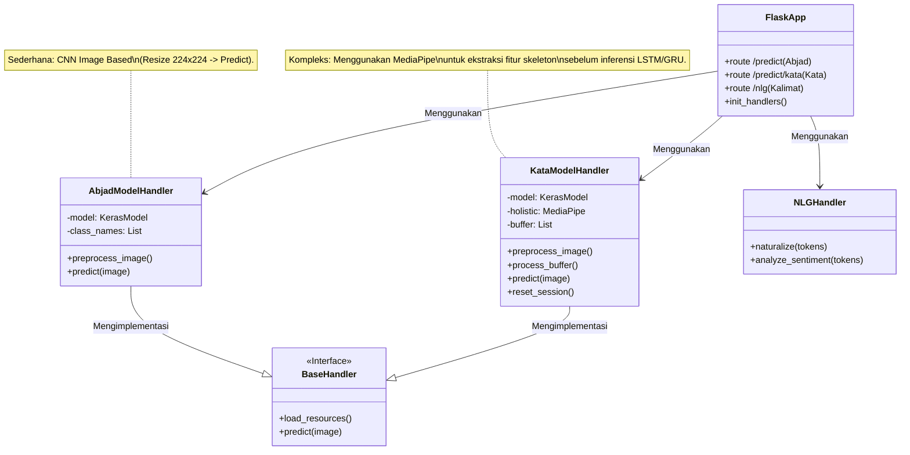
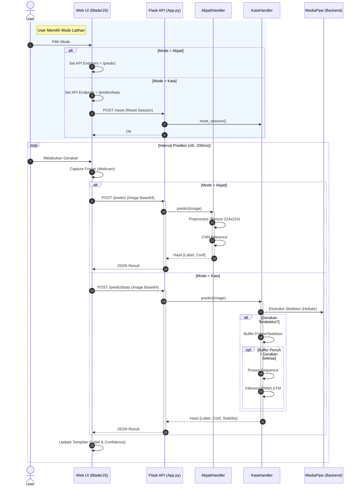

# Diagram Integrasi Mode AI (Abjad & Kata)

Dokumen ini menjelaskan bagaimana **Mode Abjad** dan **Mode Kata** diintegrasikan ke dalam sistem BisindoCNNfi, mulai dari sisi Frontend (User Interface) hingga Backend (Flask API).

## 1. Arsitektur Komponen (Class Diagram)

Diagram ini menggambarkan struktur backend dan hubungan antar handler.

---

## 2. Alur Eksekusi Mode (Sequence Diagram)

Diagram ini menjelaskan bagaimana sistem menangani perpindahan mode dan eksekusi prediksi.

## 3. Penjelasan Integrasi

### 3.1 Routing
Sistem menggunakan **Endpoint Routing** untuk membedakan mode:
- **Mode Abjad**: Mengirim request ke `/predict`. Endpoint ini diarahkan ke `AbjadModelHandler` yang menggunakan model CNN ringan untuk klasifikasi gambar statis (per frame).
- **Mode Kata**: Mengirim request ke `/predict/kata`. Endpoint ini diarahkan ke `KataModelHandler` yang lebih kompleks.

### 3.2 Perbedaan Logic Handler
- **Abjad**: `Input Gambar` -> `Resize` -> `CNN Model` -> `Output Huruf`. Sifatnya *stateless* (tidak peduli frame sebelumnya).
- **Kata**: `Input Gambar` -> `MediaPipe Holistic` (Ekstraksi Skeleton) -> `Motion Analysis` -> `Buffering` -> `Sequence Model` -> `Output Kata`. Sifatnya *stateful* (bergantung pada urutan frame/gerakan), sehingga memerlukan endpoint `/reset` saat ganti sesi.

### 3.3 Frontend Logic
Frontend (`index.blade.php` & JS) bertanggung jawab untuk:
1. Menentukan endpoint tujuan berdasarkan mode yang aktif.
2. Mengirim frame secara periodik (looping).
3. Melakukan visualisasi dasar (bounding box) menggunakan MediaPipe sisi client (opsional/visual only) atau murni mengirim gambar ke server.
