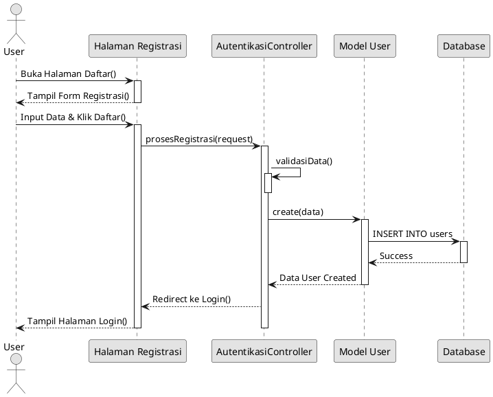
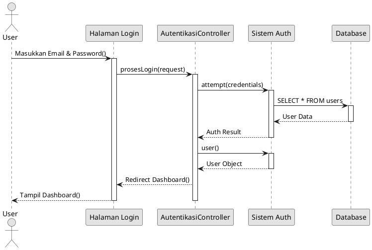
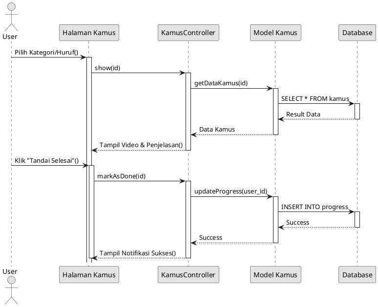
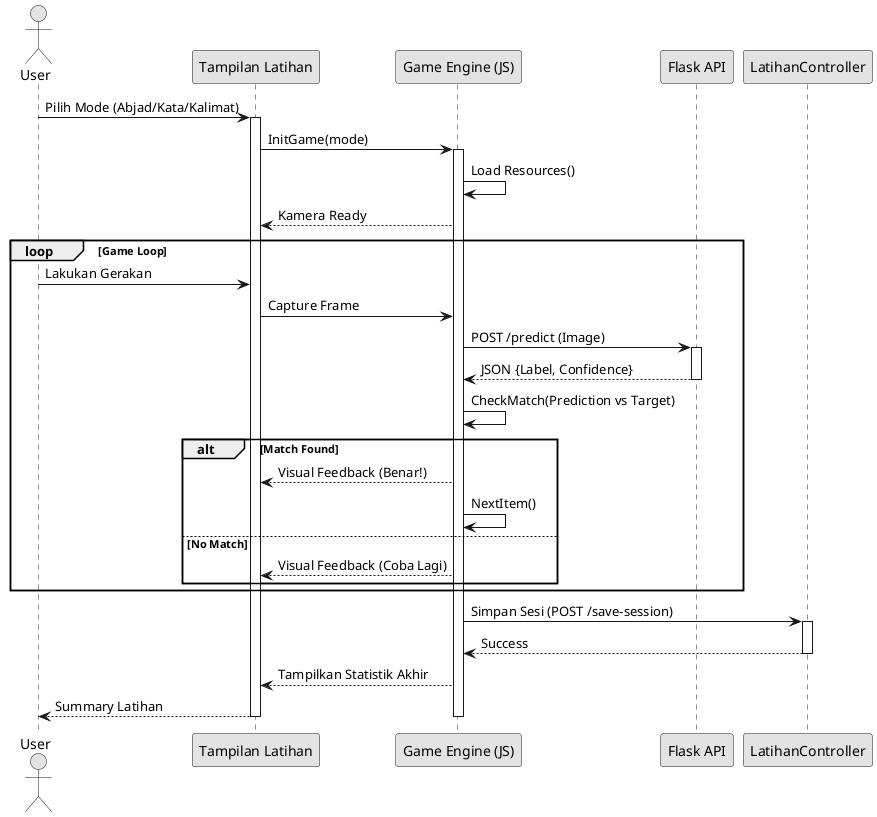
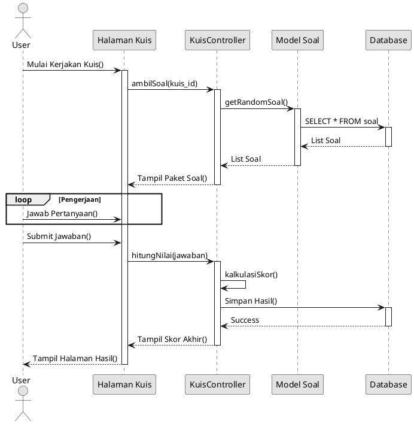
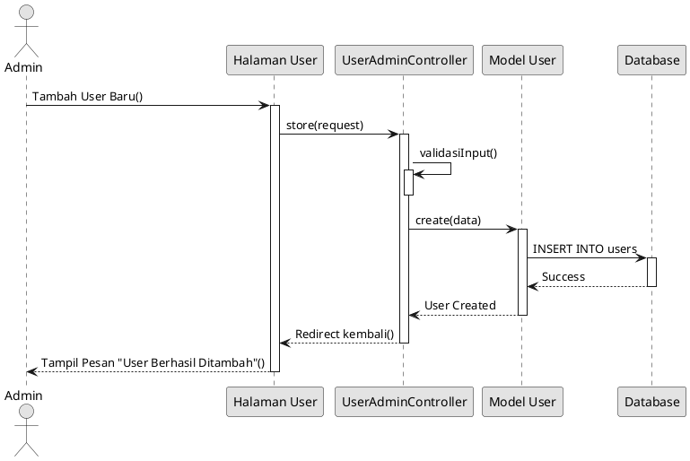
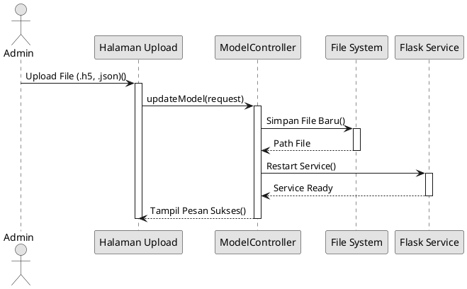

# Sequence Diagram Sistem BisindoCNN

Berikut adalah **Sequence Diagram** yang telah disederhanakan (Linear Flow) dan dibuat **Hitam Putih** (Monochrome).
- Kotak `alt` (pilihan kondisi) telah dihilangkan agar tampilan lebih bersih sesuai keinginan Anda.
- Diagram hanya menampilkan alur **Berhasil** (Happy Path).

> **Cara Render:** Buka file ini di VS Code, lalu tekan `Alt + D`.

---

## Legenda Simbol (Sequence Diagram)

| Simbol | Nama | Fungsi | Representasi di PlantUML |
| :---: | :--- | :--- | :--- |
| 👤 | **Actor** | Pengguna atau sistem eksternal yang berinteraksi. | `actor Nama` |
| ⬜ | **Lifeline/Participant** | Objek atau sistem yang hidup selama interaksi. | `participant "Nama"` |
| ➝ | **Synchronous Message** | Pesan kirim yang menunggu balasan (blokir). | `->` (Panah solid) |
| ⇢ | **Return Message** | Balasan dari pesan sebelumnya. | `-->` (Panah putus-putus) |
| ▭ | **Activation Bar** | Menandakan periode objek sedang aktif/memproses. | `activate`, `deactivate` |
| 🔄 | **Loop** | Pengulangan proses. | `loop ... end` |
| 🔷 | **Alt/Opt** | Percabangan kondisi (Alternatif/Opsional). | `alt ... else ... end` |

---

## 1. Sequence Diagram: Registrasi

## 2. Sequence Diagram: Login

## 3. Sequence Diagram: Fitur Kamus

## 4. Sequence Diagram: Latihan Deteksi (Real-time)

## 5. Sequence Diagram: Pengerjaan Kuis

## 6. Sequence Diagram: Manajemen User (Admin)

## 7. Sequence Diagram: Upload Model AI (Admin)

