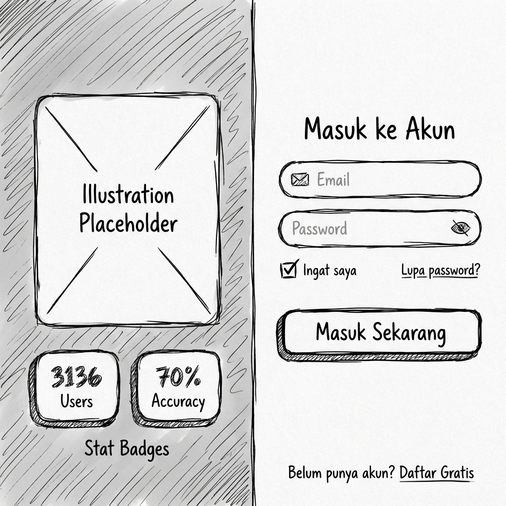
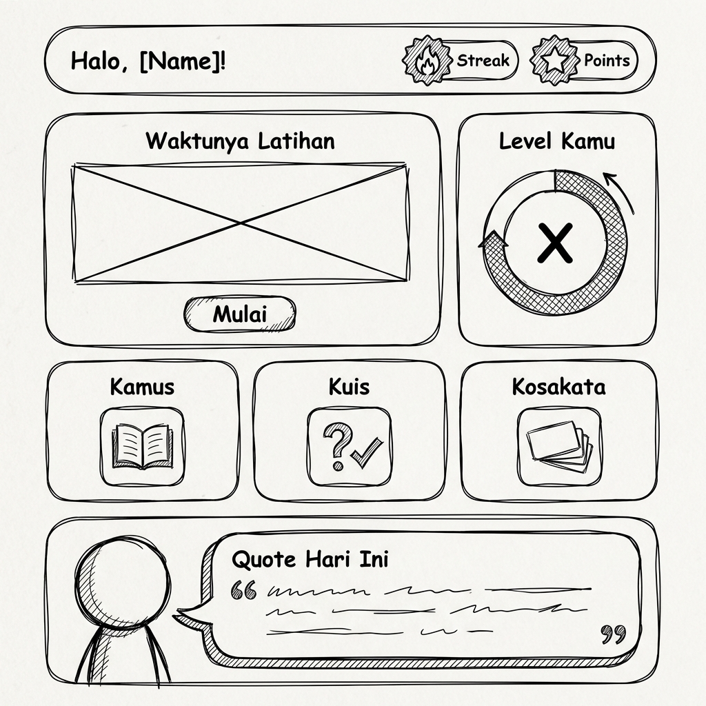
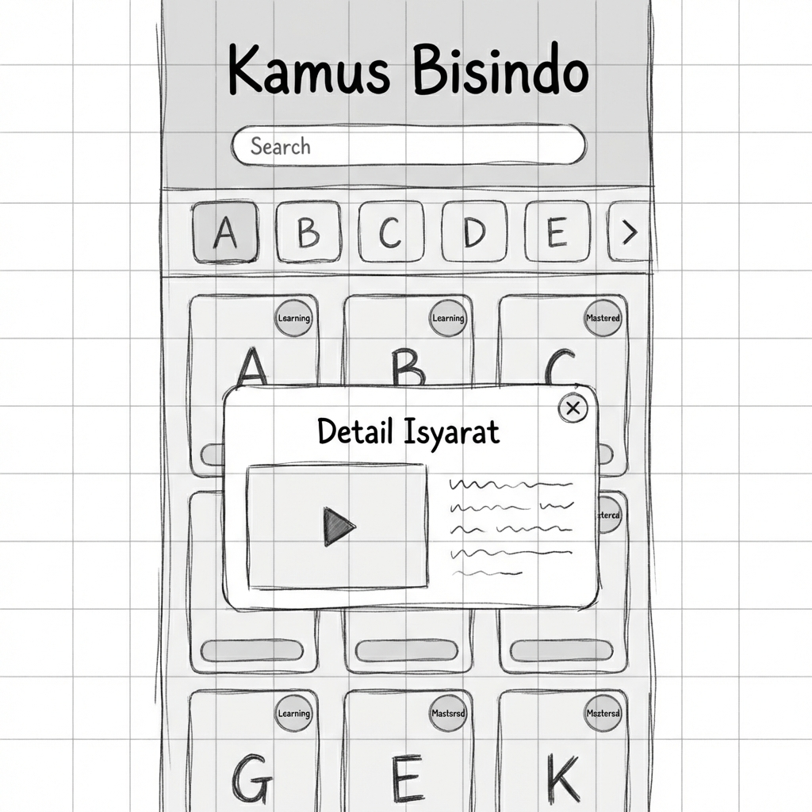
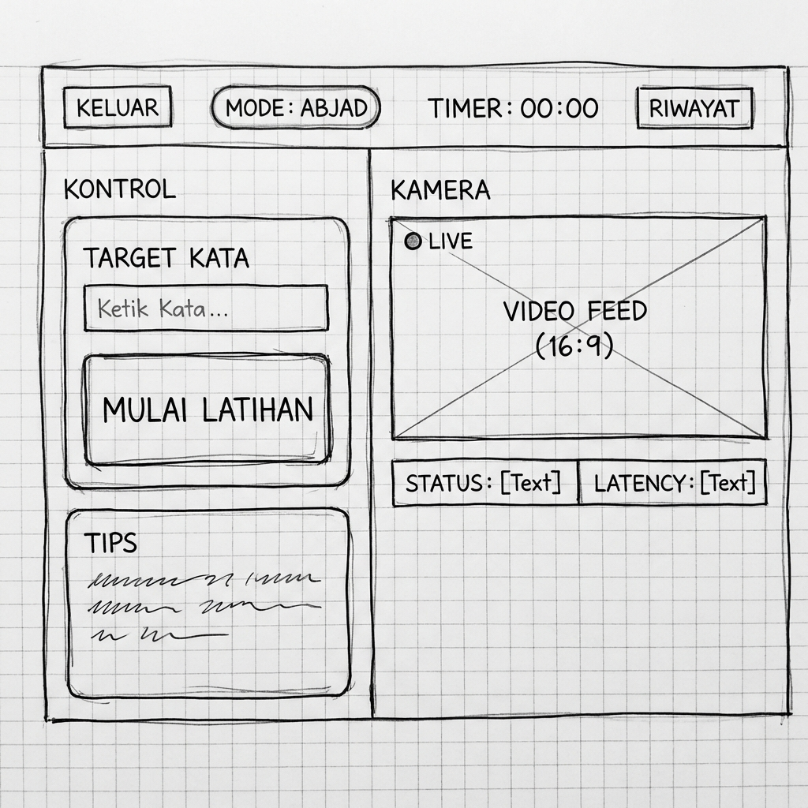
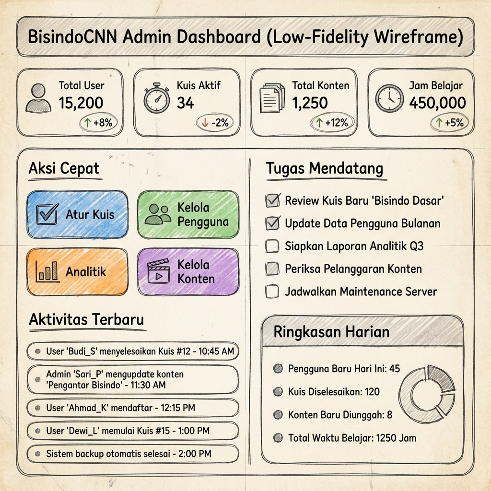
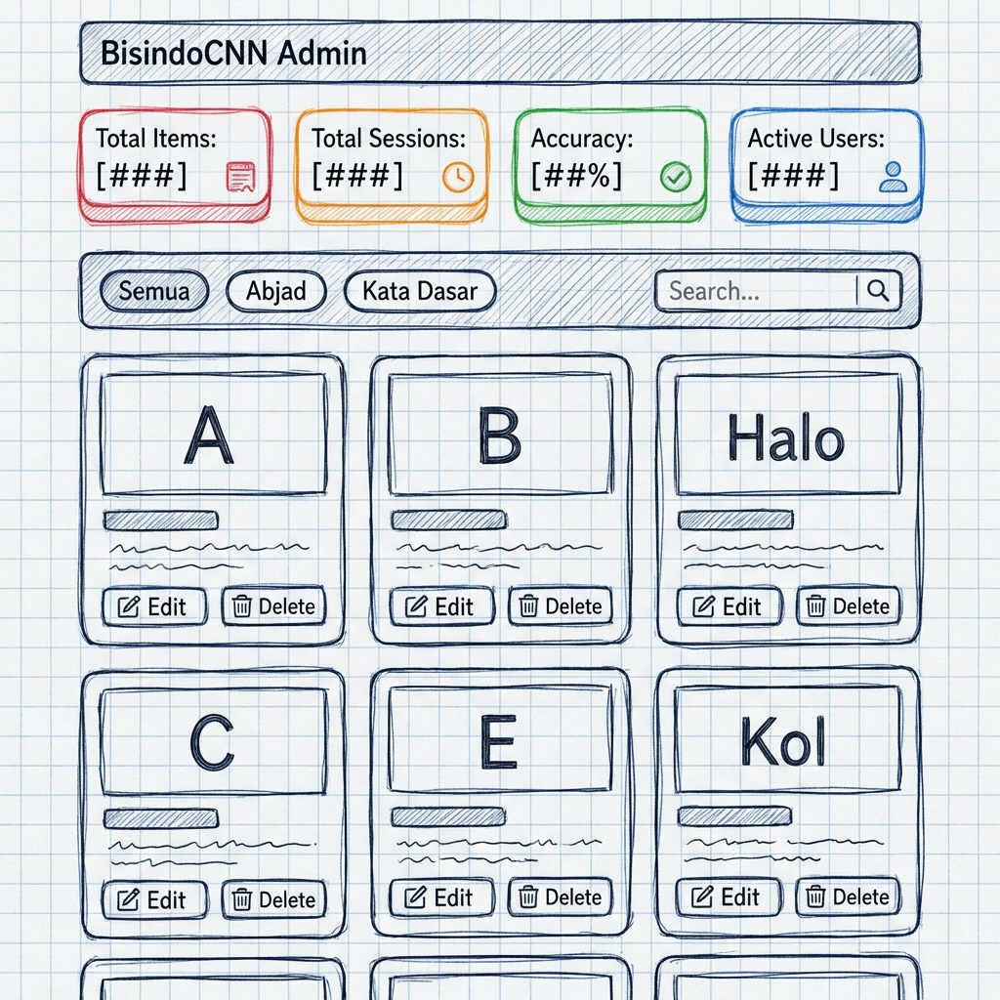

# Wireframe Desain Antarmuka BisindoCNN

Berikut adalah rancangan wireframe *low-fidelity* yang telah disesuaikan dengan tata letak aktual aplikasi BisindoCNN. File gambar disimpan di folder `Wireframes/`.

## 1. Halaman Login
Layout Split Screen: Visual/Ilustrasi di kiri, Form Login di kanan.

## 2. Dashboard User
Menampilkan "Halo User", kartu "Waktunya Latihan", Ring Level, dan Quote harian di bagian bawah.

## 3. Halaman Kamus Bisindo
Filter Abjad horizontal, Grid Kartu Isyarat dengan efek glow, dan Modal Detail yang muncul di tengah.

## 4. Halaman Latihan Deteksi (Real-time)
Panel Kontrol di kiri (Input Kata), Feed Kamera Besar di kanan dengan status layaknya aplikasi live.

## 5. Halaman Kuis (User)
Menampilkan banner motivasi "Asah Kemampuan", statistik singkat, dan daftar paket kuis yang tersedia.

## 6. Dashboard Admin (Back-office)
Pusat kontrol admin dengan statistik pengguna, aksi cepat (Quick Actions), dan log aktivitas terbaru.

## 7. Kelola Konten (Admin)
Halaman manajemen data kamus dengan statistik konten, filter kategori (Abjad/Kata), dan grid item yang bisa diedit.

