# 🎯 **COMPLEX FLOWCHART SISTEM BISINDO CNN**

## 1️⃣ **STATE MACHINE - KALIMAT MODE COMPLEX**

```mermaid
stateDiagram-v2
    direction LR
    
    [*] --> SystemBoot: Power On
    SystemBoot --> SystemReady: Initialization Complete
    SystemReady --> ModeSelection: User Authentication Success
    
    state ModeSelection {
        [*] --> ModeIdle
        ModeIdle --> KalimatSelected: Select Kalimat Mode
        KalimatSelected --> KalimatModeActive
        KalimatModeActive --> ModeIdle: Mode Complete
    }
    
    state KalimatModeActive {
        direction TB
        [*] --> KalimatInitialization
        KalimatInitialization --> SentenceParsing: Input Sentence
        
        SentenceParsing --> WordAnalysis: Analyze Words
        WordAnalysis --> TargetTypeDecision{Target Type?}
        
        TargetTypeDecision --> LetterTarget: Single Letter
        TargetTypeDecision --> WordTarget: Multiple Letters
        
        LetterTarget --> LetterDetectionState: Use Abjad API
        WordTarget --> WordDetectionState: Use Kata API
        
        LetterDetectionState --> LetterPrediction: Predict Letter
        WordDetectionState --> WordPrediction: Predict Word
        
        LetterPrediction --> LetterResultCheck{Result Check}
        WordPrediction --> WordResultCheck{Result Check}
        
        LetterResultCheck --> LetterCorrect: ✅ Correct
        LetterResultCheck --> LetterIncorrect: ❌ Incorrect
        WordResultCheck --> WordCorrect: ✅ Correct
        WordResultCheck --> WordIncorrect: ❌ Incorrect
        
        LetterCorrect --> SentenceBuilding: Update Progress
        WordCorrect --> SentenceBuilding
        LetterIncorrect --> LetterRetry: Retry Letter
        WordIncorrect --> WordRetry: Retry Word
        
        LetterRetry --> LetterRetryCheck{Retry < 3?}
        WordRetry --> WordRetryCheck{Retry < 3?}
        
        LetterRetryCheck --> LetterDetectionState: Continue
        WordRetryCheck --> WordDetectionState: Continue
        LetterRetryCheck --> LetterError: ❌ Error State
        WordRetryCheck --> WordError: ❌ Error State
        
        SentenceBuilding --> NextWordCheck{Next Word?}
        LetterError --> NextWordCheck
        WordError --> NextWordCheck
        
        NextWordCheck --> WordAnalysis: Next Word
        NextWordCheck --> SentenceComplete: ✅ Complete
        
        SentenceComplete --> [*]
    }
    
    KalimatModeActive --> ModeIdle: Exit Mode
    ModeIdle --> [*]: System Shutdown
```

---

## 2️⃣ **ERROR HANDLING & RECOVERY FLOW**

```mermaid
flowchart TD
    Start([System Start]) --> InitComponents[Initialize Components]
    
    InitComponents --> CheckAPI{Check API Status}
    CheckAPI -->|API Ready| NormalFlow[Normal Operation]
    CheckAPI -->|API Down| APIRecovery[API Recovery Process]
    
    APIRecovery --> RetryAPI{Retry API Connection}
    RetryAPI -->|Success| NormalFlow
    RetryAPI -->|Failed| FallbackMode[Fallback Mode]
    
    FallbackMode --> UseLocalCache[Use Local Cache]
    UseLocalCache --> LimitedFunctionality[Limited Functionality]
    LimitedFunctionality --> NotifyUser[Notify User]
    
    NormalFlow --> CaptureFrame[Capture Frame]
    CaptureFrame --> CheckCamera{Camera Available?}
    
    CheckCamera -->|Yes| ProcessFrame[Process Frame]
    CheckCamera -->|No| CameraError[Camera Error]
    
    CameraError --> CameraRecovery{Camera Recovery}
    CameraRecovery -->|Success| ProcessFrame
    CameraRecovery -->|Failed| CameraFallback[Camera Fallback]
    
    ProcessFrame --> DetectHands{Hands Detected?}
    DetectHands -->|Yes| SendToAPI[Send to API]
    DetectHands -->|No| NoHandsError[No Hands Error]
    
    NoHandsError --> ShowGuide[Show Hand Position Guide]
    ShowGuide --> CaptureFrame
    
    SendToAPI --> APIResponse{API Response}
    APIResponse -->|Success| ProcessResult[Process Result]
    APIResponse -->|Timeout| TimeoutError[Timeout Error]
    APIResponse -->|Error| APIError[API Error]
    
    TimeoutError --> RetryRequest{Retry Request?}
    RetryRequest -->|Yes| SendToAPI
    RetryRequest -->|No| TimeoutRecovery[Timeout Recovery]
    
    APIError --> ErrorAnalysis{Error Analysis}
    ErrorAnalysis -->|Network| NetworkRecovery[Network Recovery]
    ErrorAnalysis -->|Server| ServerRecovery[Server Recovery]
    ErrorAnalysis -->|Model| ModelRecovery[Model Recovery]
    
    ProcessResult --> ValidateResult{Validate Result}
    ValidateResult -->|Valid| UpdateUI[Update UI]
    ValidateResult -->|Invalid| InvalidResult[Invalid Result]
    
    InvalidResult --> ResultCorrection[Result Correction]
    ResultCorrection --> ConfidenceCheck{Confidence Check}
    ConfidenceCheck -->|Low| RequestNewFrame[Request New Frame]
    ConfidenceCheck -->|High| AcceptResult[Accept Result]
    
    UpdateUI --> CheckProgress{Check Progress}
    CheckProgress -->|Complete| SuccessState[✅ Success State]
    CheckProgress -->|Incomplete| ContinueTraining[Continue Training]
    
    SuccessState --> SaveSession[Save Session]
    ContinueTraining --> CaptureFrame
    
    SaveSession --> LogResults[Log Results]
    LogResults --> EndState([End State])
```



---

## 3️⃣ **MICROSERVICES ARCHITECTURE FLOW**


---

## 4️⃣ **REAL-TIME PROCESSING PIPELINE**


---

## 5️⃣ **DEPLOYMENT & INFRASTRUCTURE FLOW**


---

## 6️⃣ **MULTI-MODE COORDINATION STATE MACHINE**

```mermaid
stateDiagram-v2
    direction LR
    
    [*] --> SystemBoot: Power On
    SystemBoot --> SystemReady: Initialization Complete
    SystemReady --> ModeSelection: User Authentication Success
    
    state ModeSelection {
        [*] --> ModeIdle
        
        ModeIdle --> AbjadSelected: Select Abjad
        ModeIdle --> KataSelected: Select Kata  
        ModeIdle --> KalimatSelected: Select Kalimat
        ModeIdle --> KuisSelected: Select Kuis
        
        AbjadSelected --> AbjadModeActive
        KataSelected --> KataModeActive
        KalimatSelected --> KalimatModeActive
        KuisSelected --> KuisModeActive
        
        AbjadModeActive --> ModeIdle: Exit Abjad
        KataModeActive --> ModeIdle: Exit Kata
        KalimatModeActive --> ModeIdle: Exit Kalimat
        KuisModeActive --> ModeIdle: Exit Kuis
    }
    
    state AbjadModeActive {
        direction TB
        [*] --> AbjadInit
        AbjadInit --> LetterTarget: Set Letter Target
        LetterTarget --> LetterCapture: Capture Gesture
        LetterCapture --> LetterProcess: Process with Abjad API
        LetterProcess --> LetterResult: Get Result
        LetterResult --> LetterCheck: Check Result
        LetterCheck --> LetterSuccess: ✅ Success
        LetterCheck --> LetterRetry: Retry
        LetterSuccess --> [*]
        LetterRetry --> LetterCapture
    }
    
    state KataModeActive {
        direction TB
        [*] --> KataInit
        KataInit --> WordTarget: Set Word Target
        WordTarget --> WordCapture: Capture Gesture
        WordCapture --> WordProcess: Process with Kata API
        WordProcess --> WordResult: Get Result
        WordResult --> WordCheck: Check Result
        WordCheck --> WordSuccess: ✅ Success
        WordCheck --> WordRetry: Retry
        WordSuccess --> [*]
        WordRetry --> WordCapture
    }
    
    state KalimatModeActive {
        direction TB
        [*] --> KalimatInit
        KalimatInit --> SentenceParse: Parse Sentence
        SentenceParse --> WordLoop: For Each Word
        
        WordLoop --> WordTypeCheck{Word Type?}
        WordTypeCheck --> SingleLetter: Single Letter
        WordTypeCheck --> MultiLetter: Multiple Letters
        
        SingleLetter --> LetterState: Letter Detection
        MultiLetter --> WordState: Word Detection
        
        LetterState --> LetterAPI: Use Abjad API
        WordState --> WordAPI: Use Kata API
        
        LetterAPI --> LetterResult: Letter Result
        WordAPI --> WordResult: Word Result
        
        LetterResult --> LetterValidate: Validate Letter
        WordResult --> WordValidate: Validate Word
        
        LetterValidate --> LetterCorrect: ✅ Letter Correct
        LetterValidate --> LetterIncorrect: ❌ Letter Incorrect
        WordValidate --> WordCorrect: ✅ Word Correct
        WordValidate --> WordIncorrect: ❌ Word Incorrect
        
        LetterCorrect --> SentenceBuild: Build Sentence
        WordCorrect --> SentenceBuild
        LetterIncorrect --> LetterRetry: Retry Letter
        WordIncorrect --> WordRetry: Retry Word
        
        LetterRetry --> LetterState
        WordRetry --> WordState
        
        SentenceBuild --> NextWord: Next Word?
        NextWord --> WordLoop
        NextWord --> SentenceComplete: ✅ Sentence Complete
        
        SentenceComplete --> [*]
    }
    
    state KuisModeActive {
        direction TB
        [*] --> KuisInit
        KuisInit --> QuestionLoad: Load Question
        QuestionLoad --> AnswerCapture: Capture Answer
        AnswerCapture --> AnswerProcess: Process Answer
        AnswerProcess --> AnswerValidate: Validate Answer
        AnswerValidate --> AnswerCorrect: ✅ Correct
        AnswerValidate --> AnswerIncorrect: ❌ Incorrect
        AnswerCorrect --> ScoreUpdate: Update Score
        AnswerIncorrect --> Explanation: Show Explanation
        ScoreUpdate --> NextQuestion: Next Question?
        Explanation --> NextQuestion
        NextQuestion --> QuestionLoad
        NextQuestion --> KuisComplete: ✅ Kuis Complete
        KuisComplete --> [*]
    }
    
    ModeSelection --> SystemShutdown: Logout
    SystemShutdown --> [*]: System Off
```

---

## 📋 **TECHNICAL NOTATION GUIDE**

### 🎯 **State Machine Notation (UML 2.0)**
```
stateDiagram-v2
    direction [LR|TB|RL|BT]           # Flow direction
    [*] --> StateName: Transition     # Initial state
    StateName --> [*]: Transition     # Final state
    StateName --> OtherState: Event   # State transition
    
    state StateName {                 # Nested state
        [*] --> SubState1
        SubState1 --> SubState2
    }
    
    StateName --> Decision{Decision}  # Decision point
    Decision -->|Condition| NextState
```

### 🔄 **Flowchart Notation (BPMN 2.0)**
```
Start([Start]) --> Process[Process] --> Decision{Decision}
Decision -->|Yes| Success[✅ Success] --> End([End])
Decision -->|No| Failure[❌ Failure] --> Retry{Retry?}
Retry -->|Yes| Process
Retry -->|No| End
```

### 🏗️ **Architecture Notation**
```
subgraph "Layer Name"
    Component[Component Name
    Port: 8080]
    Database[(Database
    PostgreSQL)]
    Service>Service Name]
end
```

---

## 🔧 **IMPLEMENTATION STATE MACHINE - KALIMAT MODE**

```javascript
// Kalimat Mode State Machine Implementation
class KalimatModeStateMachine {
    constructor() {
        this.currentState = 'SystemInitialization';
        this.sentence = '';
        this.words = [];
        this.currentWordIndex = 0;
        this.retryCount = 0;
        this.maxRetries = 3;
        this.visualizationMode = 'auto'; // 'bounding_box' | 'skeleton' | 'auto'
        this.apiEndpoint = null;
        this.targetType = null; // 'letter' | 'word'
    }
    
    transition(event, data) {
        console.log(`[KalimatState] ${this.currentState} -> ${event}`, data);
        
        switch(this.currentState) {
            case 'SystemInitialization':
                if (event === 'INIT_COMPLETE') {
                    this.currentState = 'ModeSelection';
                }
                break;
                
            case 'KalimatModeActive':
                if (event === 'SENTENCE_INPUT') {
                    this.sentence = data.sentence;
                    this.words = this.parseSentence(data.sentence);
                    this.currentWordIndex = 0;
                    this.currentState = 'SentenceParsing';
                }
                break;
                
            case 'SentenceParsing':
                if (event === 'WORD_ANALYZED') {
                    const word = this.words[this.currentWordIndex];
                    if (word.length === 1) {
                        this.currentState = 'LetterDetectionState';
                        this.targetType = 'letter';
                        this.useAbjadAPI();
                    } else {
                        this.currentState = 'WordDetectionState';
                        this.targetType = 'word';
                        this.useKataAPI();
                    }
                }
                break;
                
            case 'LetterDetectionState':
                if (event === 'PREDICTION_COMPLETE') {
                    const targetInTop5 = data.top5.includes(this.words[this.currentWordIndex]);
                    const isConfident = data.confidence > 0.8;
                    
                    if (targetInTop5 || isConfident) {
                        this.currentState = 'CorrectRecognitionState';
                        this.progressUpdate();
                        this.retryCount = 0;
                    } else {
                        this.handleRetry();
                    }
                }
                break;
                
            case 'WordDetectionState':
                if (event === 'PREDICTION_COMPLETE') {
                    const targetInTop5 = data.top5.includes(this.words[this.currentWordIndex]);
                    const isConfident = data.confidence > 0.8;
                    
                    if (targetInTop5 || isConfident) {
                        this.currentState = 'CorrectRecognitionState';
                        this.progressUpdate();
                        this.retryCount = 0;
                    } else {
                        this.handleRetry();
                    }
                }
                break;
                
            case 'CorrectRecognitionState':
                if (event === 'PROGRESS_UPDATED') {
                    if (this.currentWordIndex < this.words.length - 1) {
                        this.currentWordIndex++;
                        this.currentState = 'SentenceParsing';
                    } else {
                        this.currentState = 'SentenceCompleteState';
                    }
                }
                break;
                
            case 'RetryState':
                if (event === 'RETRY_ATTEMPT') {
                    if (this.retryCount < this.maxRetries) {
                        this.retryCount++;
                        this.currentState = this.targetType === 'letter' ? 'LetterDetectionState' : 'WordDetectionState';
                    } else {
                        this.currentState = 'ErrorState';
                    }
                }
                break;
                
            case 'ErrorState':
                if (event === 'ERROR_HANDLED') {
                    this.currentWordIndex++;
                    this.retryCount = 0;
                    if (this.currentWordIndex < this.words.length) {
                        this.currentState = 'SentenceParsing';
                    } else {
                        this.currentState = 'SentenceCompleteState';
                    }
                }
                break;
                
            case 'SentenceCompleteState':
                if (event === 'SESSION_COMPLETE') {
                    this.currentState = 'ModeSelection';
                    this.resetState();
                }
                break;
        }
        
        this.logState();
    }
    
    useAbjadAPI() {
        this.apiEndpoint = '/api/abjad/predict';
        this.visualizationMode = 'bounding_box';
        console.log(`[KalimatState] Using Abjad API with bounding box visualization`);
        return { endpoint: this.apiEndpoint, visualization: this.visualizationMode };
    }
    
    useKataAPI() {
        this.apiEndpoint = '/api/kata/predict';
        this.visualizationMode = 'skeleton';
        console.log(`[KalimatState] Using Kata API with skeleton visualization`);
        return { endpoint: this.apiEndpoint, visualization: this.visualizationMode };
    }
    
    parseSentence(sentence) {
        return sentence.split(' ').filter(word => word.length > 0);
    }
    
    progressUpdate() {
        const progress = ((this.currentWordIndex + 1) / this.words.length) * 100;
        console.log(`[KalimatState] Progress: ${progress.toFixed(1)}%`);
        this.transition('PROGRESS_UPDATED');
    }
    
    handleRetry() {
        console.log(`[KalimatState] Retry attempt ${this.retryCount + 1}/${this.maxRetries}`);
        this.transition('RETRY_ATTEMPT');
    }
    
    resetState() {
        this.sentence = '';
        this.words = [];
        this.currentWordIndex = 0;
        this.retryCount = 0;
        this.targetType = null;
        this.apiEndpoint = null;
    }
    
    logState() {
        console.log(`[KalimatState] Current: ${this.currentState}, Word: ${this.currentWordIndex}/${this.words.length}, Target: ${this.targetType}, Retries: ${this.retryCount}`);
    }
    
    getCurrentTarget() {
        return this.words[this.currentWordIndex] || null;
    }
    
    getProgress() {
        return this.words.length > 0 ? (this.currentWordIndex / this.words.length) * 100 : 0;
    }
}

// Usage Example
const kalimatStateMachine = new KalimatModeStateMachine();

// Initialize kalimat mode
kalimatStateMachine.transition('INIT_COMPLETE');
kalimatStateMachine.transition('SENTENCE_INPUT', { sentence: 'SAYA SUKA MAKAN' });

// Simulate prediction completion
kalimatStateMachine.transition('PREDICTION_COMPLETE', {
    top5: ['S', 'A', 'Y', 'SAYA', 'SUKA'],
    confidence: 0.85
});
```

---

## 📊 **MICROSERVICES SPECIFICATION TABLE**

| **Service** | **Port** | **Technology** | **Responsibility** | **Dependencies** |
|-------------|----------|----------------|-------------------|------------------|
| **API Gateway** | 8000 | Kong/Nginx | Routing, Auth, Rate Limit | All Services |
| **Auth Service** | 8001 | Node.js/Express | JWT, User Auth | User DB |
| **User Service** | 8002 | Laravel | User Management | User DB |
| **Session Service** | 8003 | Redis + Node.js | Session Management | Redis |
| **Progress Service** | 8004 | Python/FastAPI | Learning Analytics | User DB |
| **Content Service** | 8005 | Laravel | Content Management | Content DB |
| **Abjad Service** | 8006 | Python/Flask | Letter Detection | TensorFlow, Model Storage |
| **Kata Service** | 8007 | Python/Flask | Word Detection | TensorFlow, Model Storage |
| **Kalimat Service** | 8008 | Python/FastAPI | Sentence Processing | Abjad + Kata Services |
| **Model Manager** | 8009 | Python/FastAPI | Model Lifecycle | Model Storage |
| **Monitoring** | 8010 | Prometheus/Grafana | Metrics & Alerts | All Services |

---

## 🎯 **KEY FEATURES IMPLEMENTATION**

### ✅ **Dynamic API Selection**
- **Letter Detection**: Uses Abjad API with bounding box visualization
- **Word Detection**: Uses Kata API with skeleton & landmarks visualization
- **Automatic Switching**: Based on target word length

### ✅ **Error Recovery System**
- **Retry Logic**: Up to 3 attempts per target
- **Fallback Mechanisms**: Local cache, limited functionality
- **Graceful Degradation**: Continue with reduced features

### ✅ **State Management**
- **Persistent State**: Session-based progress tracking
- **State Recovery**: Resume from last completed word
- **Conflict Resolution**: Handle concurrent mode switches

### ✅ **Performance Optimization**
- **Caching Strategy**: LRU cache for predictions
- **Batch Processing**: Multiple frames processing
- **Lazy Loading**: Load models on demand

### ✅ **Monitoring & Observability**
- **Distributed Tracing**: Request flow tracking
- **Health Checks**: Service availability monitoring
- **Performance Metrics**: Latency, throughput, error rates

---

## 🔒 **SECURITY CONSIDERATIONS**

### Authentication & Authorization
- **JWT Tokens**: Stateless authentication
- **Role-Based Access**: User vs Admin permissions
- **API Rate Limiting**: Prevent abuse

### Data Protection
- **Encryption at Rest**: Database encryption
- **Encryption in Transit**: TLS 1.3
- **PII Handling**: Personal data protection

### Model Security
- **Model Encryption**: Protect intellectual property
- **Input Validation**: Prevent adversarial attacks
- **Output Sanitization**: Clean predictions

---

*This complex flowchart represents the complete system architecture with microservices, state machines, error handling, and deployment strategies. All diagrams use industry-standard notations (BPMN 2.0, UML 2.0, and cloud architecture symbols).*