# 🎯 Flowchart Sistem BISINDO CNN

## 1️⃣ **FLOWCHART USER FLOW - MODE LATIHAN**

```mermaid
flowchart TD
    Start([User Mulai]) --> Login{Sudah Login?}
    Login -->|Tidak| LoginForm[Form Login/Register]
    Login -->|Ya| Dashboard[Dashboard User]
    LoginForm --> Dashboard
    
    Dashboard --> PilihMode{Pilih Mode Latihan}
    PilihMode -->|Abjad| ModeAbjad[Mode Latihan Abjad]
    PilihMode -->|Kata| ModeKata[Mode Latihan Kata]
    PilihMode -->|Kalimat| ModeKalimat[Mode Latihan Kalimat]
    PilihMode -->|Kuis| ModeKuis[Mode Kuis]
    
    ModeAbjad --> SetupKamera[Setup Kamera]
    ModeKata --> SetupKamera
    ModeKalimat --> SetupKamera
    SetupKamera --> CekAPI{API Ready?}
    
    CekAPI -->|Tidak| ErrorAPI[Error: API Tidak Tersedia]
    CekAPI -->|Ya| MulaiLatih[Mulai Latihan]
    
    MulaiLatih --> TargetHuruf[Target: Huruf Abjad]
    MulaiLatih --> TargetKata[Target: Kata Dasar]
    MulaiLatih --> TargetKalimat[Target: Kalimat]
    
    TargetHuruf --> CaptureFrame[Capture Frame Kamera]
    TargetKata --> CaptureFrame
    TargetKalimat --> CaptureFrame
    
    CaptureFrame --> DeteksiTangan{Deteksi Tangan?}
    DeteksiTangan -->|Tidak| CaptureFrame
    DeteksiTangan -->|Ya| ProsesGesture[Proses Gesture Recognition]
    
    ProsesGesture --> KirimAPI[Kirim ke Python API]
    KirimAPI --> PrediksiModel{Prediksi Model AI}
    
    PrediksiModel -->|Abjad| HasilAbjad[Hasil: Huruf Terdeteksi]
    PrediksiModel -->|Kata| HasilKata[Hasil: Kata Terdeteksi]
    PrediksiModel -->|Kalimat| HasilKalimat[Hasil: Huruf/Kata dalam Kalimat]
    
    HasilAbjad --> CekTarget{Sesuai Target?}
    HasilKata --> CekTargetKata{Sesuai Target?}
    HasilKalimat --> CekTargetKalimat{Sesuai Target?}
    
    CekTarget -->|Ya| Benar[✅ Benar]
    CekTarget -->|Tidak| CekTop5{Masuk Top 5?}
    CekTop5 -->|Ya| Benar
    CekTop5 -->|Tidak| Salah[❌ Salah]
    
    Benar --> UpdateProgress[Update Progress]
    Salah --> Ulangi[Ulangi Latihan]
    
    UpdateProgress --> NextTarget{Masih Ada Target?}
    NextTarget -->|Ya| TargetSelanjutnya[Target Selanjutnya]
    NextTarget -->|Tidak| SelesaiLatih[✨ Selesai Latihan]
    
    TargetSelanjutnya --> CaptureFrame
    SelesaiLatih --> SimpanSession[Simpan Session]
    SimpanSession --> Dashboard
```

---

## 2️⃣ **FLOWCHART ADMIN FLOW - MANAJEMEN SISTEM**

```mermaid
flowchart TD
    Start([Admin Login]) --> LoginForm[Form Login Admin]
    LoginForm --> Validasi{Validasi Kredensial}
    
    Validasi -->|Tidak Valid| ErrorLogin[❌ Login Gagal]
    Validasi -->|Valid| DashboardAdmin[Dashboard Admin]
    
    DashboardAdmin --> PilihMenu{Pilih Menu Admin}
    
    PilihMenu -->|Manajemen User| UserMenu[Manajemen User]
    PilihMenu -->|Manajemen Konten| KontenMenu[Manajemen Konten]
    PilihMenu -->|Manajemen Model| ModelMenu[Manajemen Model AI]
    PilihMenu -->|Analitik| AnalitikMenu[Dashboard Analitik]
    PilihMenu -->|Kuis| KuisMenu[Manajemen Kuis]
    
    UserMenu --> LihatUser[Daftar User]
    UserMenu --> TambahUser[Tambah User Baru]
    UserMenu --> EditUser[Edit User]
    UserMenu --> HapusUser[Hapus User]
    
    KontenMenu --> ManajemenAbjad[Manajemen Abjad]
    KontenMenu --> ManajemenKata[Manajemen Kata Dasar]
    KontenMenu --> ManajemenKalimat[Manajemen Kalimat]
    
    ManajemenAbjad --> TambahAbjad[Tambah Huruf Abjad]
    ManajemenAbjad --> EditAbjad[Edit Huruf Abjad]
    ManajemenAbjad --> HapusAbjad[Hapus Huruf Abjad]
    
    ManajemenKata --> TambahKata[Tambah Kata Dasar]
    ManajemenKata --> EditKata[Edit Kata Dasar]
    ManajemenKata --> HapusKata[Hapus Kata Dasar]
    
    ModelMenu --> UploadModel[Upload Model AI Baru]
    ModelMenu --> UpdateModel[Update Model AI]
    ModelMenu --> TestModel[Test Model AI]
    ModelMenu --> BackupModel[Backup Model]
    
    AnalitikMenu --> StatistikUser[Statistik User]
    AnalitikMenu --> StatistikLatihan[Statistik Latihan]
    StatistikLatihan --> PerformaUser[Performa User per Mode]
    StatistikLatihan --> ProgressUser[Progress User]
    
    KuisMenu --> BuatKuis[Buat Kuis Baru]
    KuisMenu --> EditKuis[Edit Kuis]
    KuisMenu --> HapusKuis[Hapus Kuis]
    KuisMenu --> LihatHasil[Lihat Hasil Kuis User]
    
    TambahUser --> ValidasiUser{Validasi Data}
    EditUser --> ValidasiUser
    TambahAbjad --> ValidasiAbjad{Validasi Abjad}
    EditAbjad --> ValidasiAbjad
    TambahKata --> ValidasiKata{Validasi Kata}
    EditKata --> ValidasiKata
    
    ValidasiUser -->|Valid| SimpanUser[Simpan User]
    ValidasiUser -->|Tidak Valid| ErrorUser[❌ Error Validasi]
    ValidasiAbjad -->|Valid| SimpanAbjad[Simpan Abjad]
    ValidasiAbjad -->|Tidak Valid| ErrorAbjad[❌ Error Validasi]
    ValidasiKata -->|Valid| SimpanKata[Simpan Kata]
    ValidasiKata -->|Tidak Valid| ErrorKata[❌ Error Validasi]
    
    SimpanUser --> SuksesUser[✅ User Disimpan]
    SimpanAbjad --> SuksesAbjad[✅ Abjad Disimpan]
    SimpanKata --> SuksesKata[✅ Kata Disimpan]
    
    SuksesUser --> DashboardAdmin
    SuksesAbjad --> DashboardAdmin
    SuksesKata --> DashboardAdmin
```

---

## 3️⃣ **FLOWCHART TEKNIS - PROSES DETEKSI GESTURE**

```mermaid
flowchart TD
    Start([Start Camera]) --> InitMediaPipe[Initialize MediaPipe]
    InitMediaPipe --> SetupCanvas[Setup Canvas & Context]
    
    SetupCanvas --> StartStream[Start Camera Stream]
    StartStream --> CaptureFrame[Capture Frame]
    
    CaptureFrame --> ProcessFrame[Process Frame]
    ProcessFrame --> DetectHands{Hand Detection}
    
    DetectHands -->|No Hands| CaptureFrame
    DetectHands -->|Hands Detected| ExtractLandmarks[Extract Landmarks]
    
    ExtractLandmarks --> ProcessLandmarks{Process Landmarks}
    
    ProcessLandmarks -->|Abjad Mode| DrawBoundingBox[Draw Bounding Box]
    ProcessLandmarks -->|Kata/Kalimat Mode| DrawSkeleton[Draw Skeleton & Landmarks]
    
    DrawBoundingBox --> PrepareImage[Prepare Image for API]
    DrawSkeleton --> PrepareImage
    
    PrepareImage --> ConvertBase64[Convert to Base64]
    ConvertBase64 --> SendAPI[Send to Python API]
    
    SendAPI --> APIProcessing{API Processing}
    
    APIProcessing -->|Abjad| AbjadHandler[Abjad Handler]
    APIProcessing -->|Kata| KataHandler[Kata Handler]
    APIProcessing -->|Kalimat| KalimatHandler[Kalimat Handler]
    
    AbjadHandler --> LoadAbjadModel[Load Abjad Model]
    KataHandler --> LoadKataModel[Load Kata Model]
    KalimatHandler --> DetermineTargetType{Determine Target Type}
    
    DetermineTargetType -->|Letter| LoadAbjadModel
    DetermineTargetType -->|Word| LoadKataModel
    
    LoadAbjadModel --> PredictAbjad[Predict Abjad]
    LoadKataModel --> PredictKata[Predict Kata]
    
    PredictAbjad --> GetTop5Abjad[Get Top 5 Predictions]
    PredictKata --> GetTop5Kata[Get Top 5 Predictions]
    
    GetTop5Abjad --> ReturnResults[Return Results]
    GetTop5Kata --> ReturnResults
    
    ReturnResults --> DisplayResults[Display Results]
    DisplayResults --> UpdateUI[Update UI]
    
    UpdateUI --> CheckTarget{Check Target Match}
    CheckTarget -->|Match| SuccessFeedback[✅ Success Feedback]
    CheckTarget -->|No Match| ContinueFeedback[Continue Training]
    
    SuccessFeedback --> NextTarget{Next Target?}
    ContinueFeedback --> CaptureFrame
    
    NextTarget -->|Yes| CaptureFrame
    NextTarget -->|No| EndSession[End Session]
    
    EndSession --> SaveProgress[Save Progress]
    SaveProgress --> DisplayStats[Display Statistics]
```

---

## 4️⃣ **FLOWCHART ARSITEKTUR SISTEM KESELURUHAN**

---

## 5️⃣ **FLOWCHART MODE KALIMAT - LOGIKA BARU**

```mermaid
flowchart TD
    Start([Mode Kalimat]) --> InputKalimat[Input Kalimat Target]
    InputKalimat --> ParseKalimat[Parse Kalimat]
    
    ParseKalimat --> SplitWords[Split into Words]
    SplitWords --> ProcessWord{Process Each Word}
    
    ProcessWord -->|Single Letter| LetterMode[Letter Detection Mode]
    ProcessWord -->|Multiple Letters| WordMode[Word Detection Mode]
    
    LetterMode --> UseAbjadAPI[Use Abjad API]
    WordMode --> UseKataAPI[Use Kata API]
    
    UseAbjadAPI --> DrawBoundingBox[Draw Bounding Box]
    UseKataAPI --> DrawSkeleton[Draw Skeleton & Landmarks]
    
    DrawBoundingBox --> CaptureGesture[Capture Gesture]
    DrawSkeleton --> CaptureGesture
    
    CaptureGesture --> SendToAPI[Send to Appropriate API]
    SendToAPI --> GetPrediction[Get Prediction]
    
    GetPrediction --> CheckTop5{Check Top 5 Results}
    CheckTop5 -->|Target in Top 5| MarkCorrect[✅ Mark as Correct]
    CheckTop5 -->|Target not in Top 5| CheckConfidence{Check Confidence}
    
    CheckConfidence -->|High Confidence| MarkCorrect
    CheckConfidence -->|Low Confidence| MarkIncorrect[❌ Mark as Incorrect]
    
    MarkCorrect --> BuildSentence[Build Sentence Progress]
    MarkIncorrect --> RetryWord[Retry Current Word]
    
    BuildSentence --> NextWord{Next Word?}
    RetryWord --> CaptureGesture
    
    NextWord -->|Yes| ProcessWord
    NextWord -->|No| CompleteSentence[✅ Complete Sentence]
    
    CompleteSentence --> SaveSession[Save Session]
    SaveSession --> DisplayResults[Display Results]
```

---

## 🎨 **KETERANGAN SIMBOL FLOWCHART**

### Simbol Resmi BPMN 2.0:
- **Start/End Event**: `([ ])` - Lingkaran
- **Task/Activity**: `[ ]` - Persegi panjang
- **Decision/Gateway**: `{ }` - Belah ketupat
- **Flow/Arrow**: `-->` - Garis dengan panah
- **Sub-process**: `subgraph` - Area terbatas
- **Database**: `[( )]` - Silinder
- **Document**: `[ ]` - Persegi panjang dengan garis bawah

### Warna Kategori:
- 🟢 **User Flow**: Proses dari sudut pandang user
- 🔵 **Admin Flow**: Proses administrasi dan manajemen
- 🟡 **Technical Flow**: Proses teknis dan algoritma
- 🔴 **System Architecture**: Arsitektur keseluruhan sistem
- 🟣 **Kalimat Mode**: Flowchart khusus mode kalimat baru

---

## 📋 **FITUR-FITUR PENTING PROJECT**

### ✅ **Fitur Utama**:
1. **Mode Latihan Abjad**: Deteksi huruf BISINDO dengan bounding box
2. **Mode Latihan Kata**: Deteksi kata dasar dengan skeleton & landmarks  
3. **Mode Latihan Kalimat**: Kombinasi huruf & kata untuk membentuk kalimat
4. **Mode Kuis**: Evaluasi kemampuan user
5. **Kamus Interaktif**: Belajar abjad dan kata dasar
6. **Real-time Detection**: Penggunaan kamera untuk deteksi langsung
7. **Top 5 Recognition**: Target dianggap benar jika masuk top 5 prediksi
8. **Progress Tracking**: Tracking kemajuan belajar user
9. **Multi-API Support**: API terpisah untuk abjad dan kata

### ✅ **Fitur Admin**:
1. **Manajemen User**: CRUD user accounts
2. **Manajemen Konten**: Kelola abjad, kata, dan kalimat
3. **Manajemen Model**: Upload dan update model AI
4. **Dashboard Analitik**: Statistik dan performa sistem
5. **Manajemen Kuis**: Buat dan kelola kuis

### ✅ **Teknologi**:
- **Frontend**: Laravel Blade, JavaScript, MediaPipe
- **Backend**: Laravel Framework
- **AI/ML**: Python Flask API, TensorFlow/Keras
- **Database**: SQLite
- **Models**: CNN untuk abjad dan kata terpisah

---

*Flowchart ini menggunakan standar BPMN 2.0 dan Mermaid diagram untuk representasi visual yang valid dan profesional.*